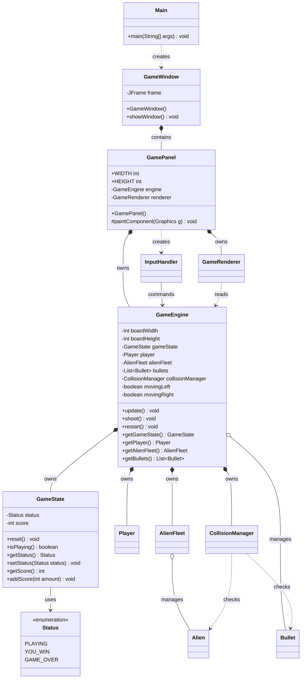
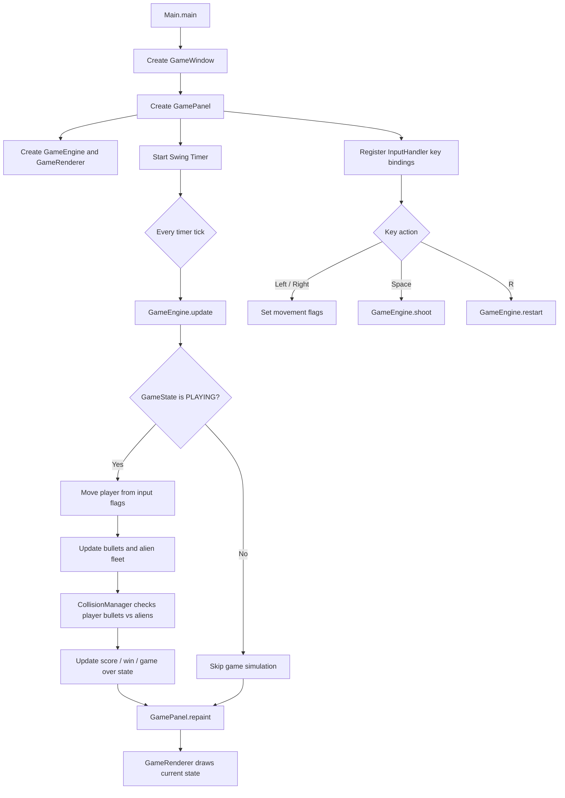
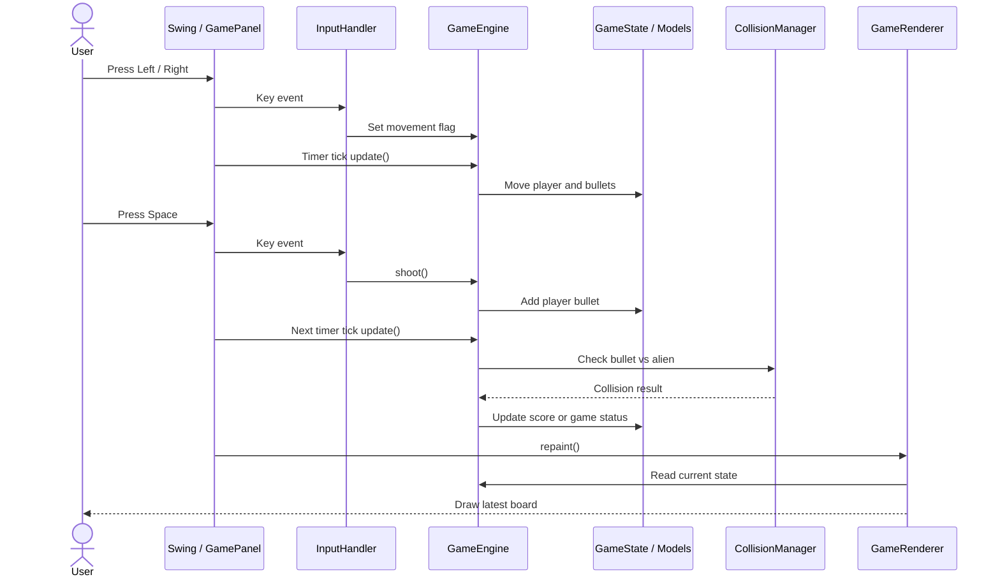
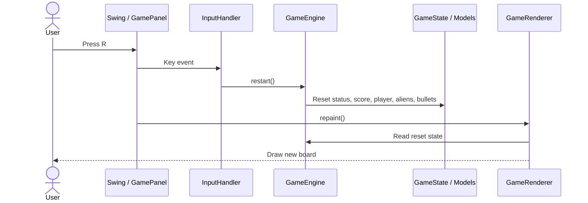

# Version 1 UML Class Model

本文件保留 Version 1 的 class model。Version 1 是「最小可玩版本」，重點是建立 Java Swing 遊戲的基本骨架：視窗、畫布、Timer game loop、Key Bindings、玩家、外星人、子彈、碰撞與分數。

目前專案已進入 Version 3；如果要看目前最新模型，請看 [Version 3 UML Class Model](uml-class-model-v3.md)。

## Class Diagram

## Flowchart

## Use Case Scenario

### Scenario 1: Move and shoot

| Step | User | Swing / GamePanel | InputHandler | GameEngine | GameState / Models | CollisionManager | GameRenderer |
| --- | --- | --- | --- | --- | --- | --- | --- |
| 1 | Presses Left or Right | Receives key event | Calls movement command | Stores movement flag | Player waits until timer update | - | - |
| 2 | Waits for frame | Timer fires | - | Moves player and updates bullets | Player position changes | - | - |
| 3 | Presses Space | Receives key event | Calls `shoot()` | Adds player bullet | Bullet list changes | - | - |
| 4 | Watches bullet travel | Timer fires again | - | Updates bullet and aliens | Bullet/alien positions change | Checks bullet vs alien | - |
| 5 | Hits alien | Calls `repaint()` | - | Applies collision result | Score/status changes | Reports destroyed alien | Draws latest board |

1. User presses Left or Right.
2. `InputHandler` updates the movement flag in `GameEngine`.
3. Swing Timer calls `GameEngine.update()`, and the player moves.
4. User presses Space, and `GameEngine.shoot()` adds a bullet.
5. `CollisionManager` checks the bullet against aliens.
6. `GameRenderer` redraws the current player, bullets, aliens, and score.

### Scenario 2: Restart after end state

| Step | User | Swing / GamePanel | InputHandler | GameEngine | GameState / Models | GameRenderer |
| --- | --- | --- | --- | --- | --- | --- |
| 1 | Presses R | Receives key event | Calls `restart()` | Starts reset flow | Current end state is replaced | - |
| 2 | Waits for repaint | Calls `repaint()` | - | Exposes reset objects | Player, aliens, bullets, and status are reset | Draws new board |

1. User presses R after winning or losing.
2. `InputHandler` calls `GameEngine.restart()`.
3. `GameEngine` resets state and model objects.
4. `GameRenderer` draws the restarted board.

## Version 1 責任分工

| Class | 責任 |
| --- | --- |
| `Main` | 程式進入點，啟動 Swing UI。 |
| `GameWindow` | 建立 `JFrame` 並放入 `GamePanel`。 |
| `GamePanel` | 使用 `Swing Timer` 進行 game loop，並觸發 repaint。 |
| `GameEngine` | 協調玩家、子彈、外星人、碰撞、勝敗與分數。 |
| `GameState` | 保存遊戲狀態與分數。 |
| `Player` | 玩家飛船位置、移動與碰撞範圍。 |
| `Alien` | 單一外星人位置、存活狀態與碰撞範圍。 |
| `AlienFleet` | 管理外星人群體移動與下降。 |
| `Bullet` | 玩家子彈。 |
| `CollisionManager` | 處理玩家子彈 vs 外星人。 |
| `InputHandler` | 使用 Key Bindings 處理鍵盤。 |
| `GameRenderer` | 使用 Java2D 繪製畫面。 |

## V1 到 V2/V3 的演化

| 主題 | Version 1 | 後續演化 |
| --- | --- | --- |
| 分數 | 放在 `GameState` | V2 移到 `ScoreManager`。 |
| 子彈 | 只有玩家子彈 | V2 新增 `BulletType` 支援敵人子彈。 |
| 狀態 | `PLAYING`、`YOU_WIN`、`GAME_OVER` | V2/V3 新增開始、暫停、過關狀態。 |
| 防護牆 | 無 | V2 新增 `Shield`。 |
| 音效/動畫/高分 | 無 | V3 新增 `SoundManager`、`ExplosionEffect`、`HighScoreManager`。 |

## 教學用途

Version 1 適合用來教：

- Swing 視窗與 `JPanel`
- `Swing Timer` game loop
- Key Bindings
- Java2D 基本繪圖
- 將遊戲拆成 engine / renderer / input / model
