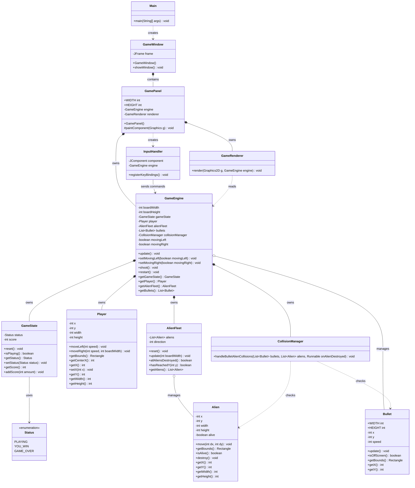

# Version 1 UML Class Model

本文件保留 Version 1 的 class model。Version 1 的目標是「最小可玩版本」，所以 class 數量少，規則集中在 `GameEngine`，尚未加入生命、敵人子彈、防護牆與關卡系統。

## Class Diagram



## Class 責任摘要

| Class | Version 1 責任 |
| --- | --- |
| `Main` | 程式進入點，啟動 Swing UI。 |
| `GameWindow` | 建立 `JFrame` 並放入 `GamePanel`。 |
| `GamePanel` | 作為遊戲畫布，使用 `Swing Timer` 觸發 update 與 repaint。 |
| `GameEngine` | 協調玩家、子彈、外星人、碰撞、勝利與失敗。 |
| `GameState` | 保存分數與遊戲狀態。 |
| `Player` | 玩家飛船的位置、移動與碰撞範圍。 |
| `Alien` | 單一外星人的位置、存活狀態與碰撞範圍。 |
| `AlienFleet` | 管理外星人群體排列、左右移動與碰邊下降。 |
| `Bullet` | 玩家子彈的位置、速度與碰撞範圍。 |
| `CollisionManager` | 處理玩家子彈與外星人的碰撞。 |
| `InputHandler` | 使用 Key Bindings 處理鍵盤輸入。 |
| `GameRenderer` | 使用 Java2D 繪製遊戲畫面。 |

## Version 1 設計重點

- 不使用外部遊戲引擎。
- 使用 `Swing Timer` 作為 game loop。
- 使用 Key Bindings，不使用 `KeyListener`。
- 尚未建立複雜抽象，例如 `GameObject` 或 `Entity`。
- 先用少量 class 建立「能玩」的基礎，再為後續版本保留擴充空間。

## Version 1 流程

```text
Main
  -> GameWindow
    -> GamePanel
      -> Swing Timer tick
        -> GameEngine.update()
          -> update player
          -> update bullets
          -> update alien fleet
          -> check collisions
          -> check win / game over
        -> GamePanel.repaint()
          -> GameRenderer.render()
```

## 往 Version 2 的演化方向

Version 1 的限制也正是 Version 2 的改進起點：

- `GameState` 需要從簡單勝敗擴充成開始、暫停、過關、結束等狀態。
- `Bullet` 需要區分玩家子彈與敵人子彈。
- `CollisionManager` 需要集中處理更多碰撞種類。
- `GameEngine` 需要把分數與關卡規則拆出去，避免變成過大的 class。
- 遊戲物件需要加入 `Shield` 等新角色。
