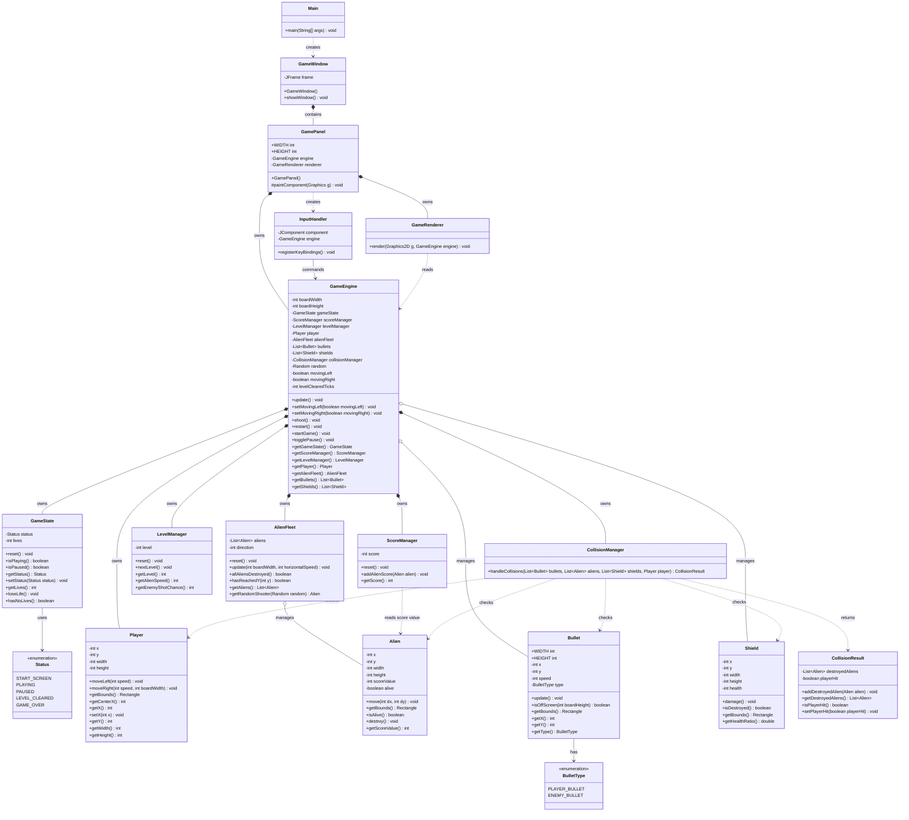

# Version 2 UML Class Model

Version 2 在 Version 1 的架構上加入完整遊戲規則：生命數、敵人射擊、防護牆、關卡推進、分數管理、暫停與重新開始。這一版的設計目標是「規則變多，但 class 責任仍然清楚」。

## Class Diagram



## Class 責任摘要

| Class | Version 2 責任 |
| --- | --- |
| `GameEngine` | 遊戲流程協調者，負責 update 順序、狀態切換、射擊、關卡切換。 |
| `GameState` | 保存目前狀態與玩家生命數。 |
| `ScoreManager` | 管理分數，依照被擊中的 `Alien` 加分。 |
| `LevelManager` | 管理關卡、外星人速度、敵人射擊頻率。 |
| `BulletType` | 區分玩家子彈與敵人子彈。 |
| `Bullet` | 根據 `BulletType` 決定往上或往下移動。 |
| `Shield` | 防護牆，保存耐久度並提供碰撞範圍。 |
| `CollisionManager` | 集中處理玩家子彈、敵人子彈、外星人、防護牆、玩家之間的碰撞。 |
| `CollisionResult` | 把碰撞結果回傳給 `GameEngine`，讓流程層決定加分與扣命。 |
| `AlienFleet` | 管理外星人群體移動，也負責挑選可射擊的前排外星人。 |
| `GameRenderer` | 根據 V2 狀態繪製 HUD、子彈類型、防護牆、暫停與過關畫面。 |
| `InputHandler` | 加入 `Enter` 開始/重開與 `P` 暫停。 |

## Version 2 流程

```text
Swing Timer tick
  -> GameEngine.update()
    -> if LEVEL_CLEARED, run level transition
    -> if not PLAYING, skip update
    -> update player
    -> update bullets
    -> update alien fleet by level speed
    -> maybe enemy shoots
    -> CollisionManager.handleCollisions()
      -> player bullet vs shield
      -> player bullet vs alien
      -> enemy bullet vs shield
      -> enemy bullet vs player
    -> ScoreManager adds score
    -> GameState loses life if player hit
    -> check level cleared / game over
  -> repaint()
```

## V2 的主要設計改進

- `score` 從 `GameState` 移到 `ScoreManager`，避免狀態 class 同時負責計分規則。
- `level` 與難度公式放進 `LevelManager`，避免塞進 `GameEngine`。
- `Bullet` 用 `BulletType` 支援雙向子彈，不急著拆成兩個子類別。
- `CollisionManager` 回傳結果，不直接修改分數或生命，讓碰撞判斷與遊戲規則更新分離。
- `Shield` 成為獨立物件，未來可進一步演化成多格破壞模型。
