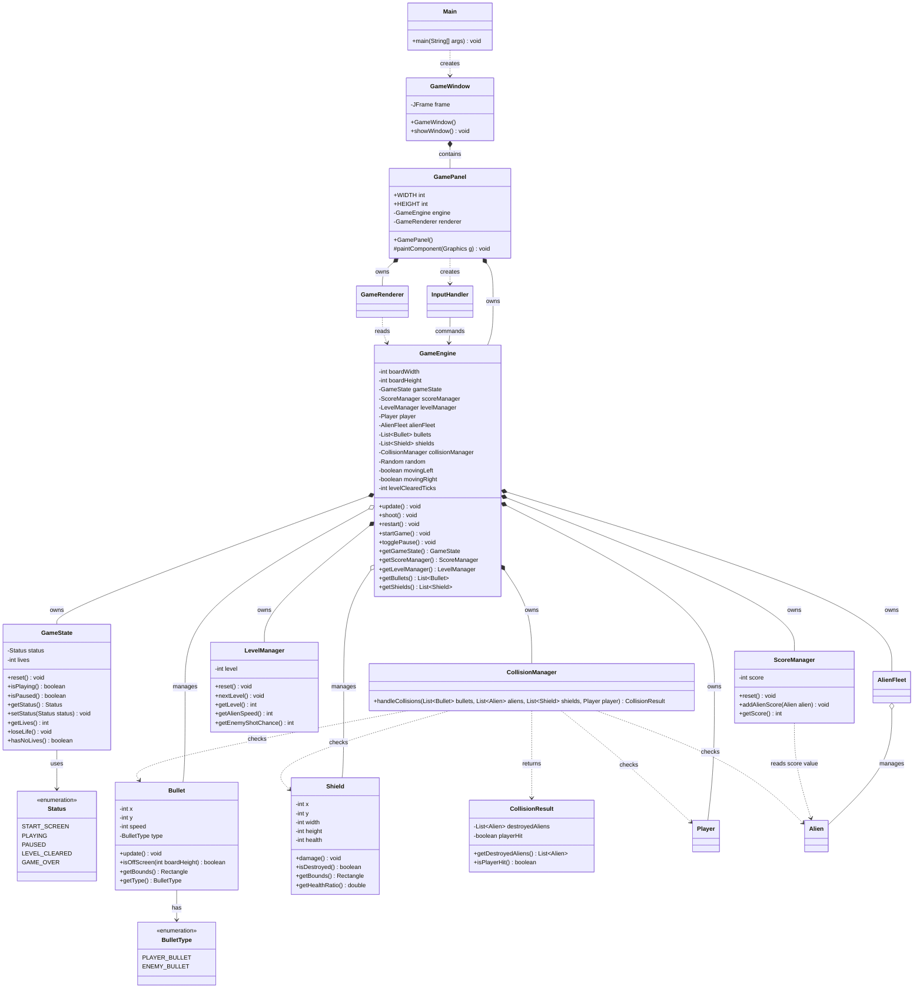

# Version 2 UML Class Model

本文件保留 Version 2 的 class model。Version 2 是「完整規則版」，重點是生命數、敵人射擊、防護牆、關卡、分數與碰撞集中管理。

目前專案已進入 Version 3；如果要看目前最新模型，請看 [Version 3 UML Class Model](uml-class-model-v3.md)。

## Class Diagram

## Version 2 設計重點

- `ScoreManager` 從 `GameState` 拆出，讓分數規則獨立。
- `LevelManager` 管理關卡、敵人速度與射擊頻率。
- `BulletType` 讓同一個 `Bullet` 支援玩家與敵人子彈。
- `CollisionManager` 集中處理四種碰撞。
- `Shield` 成為獨立物件，讓防護牆可以逐漸損壞。

## V2 到 V3 的模型差異

Version 3 在此模型上新增：

- `GameConfig`
- `SoundManager`
- `HighScoreManager`
- `ExplosionEffect`
- `Particle`

Version 3 也讓 `GameEngine` 多了體驗層協調責任：播放音效、建立爆炸效果、更新高分、控制玩家受擊閃爍。
