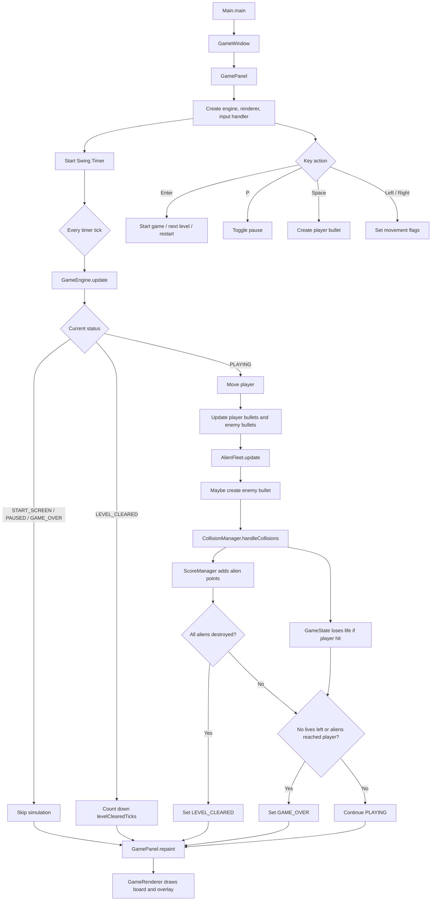
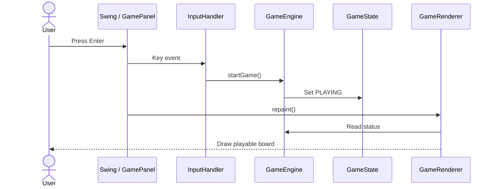
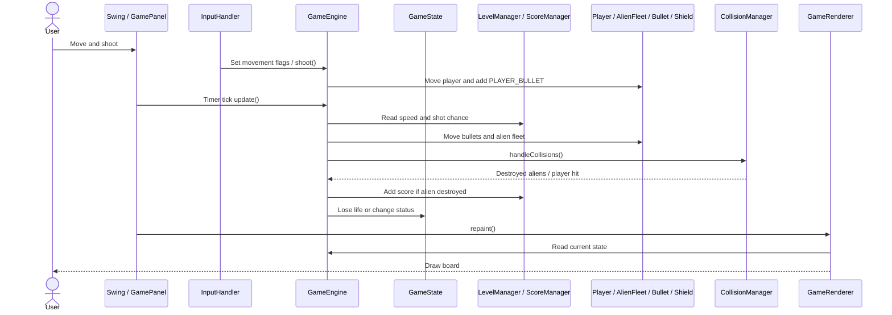
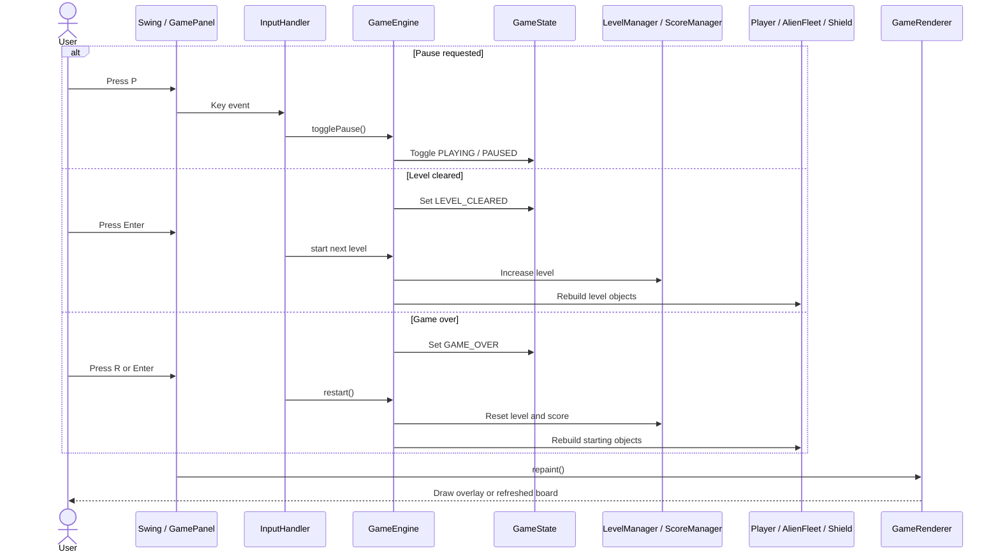

# Version 2 UML Class Model

本文件保留 Version 2 的 class model。Version 2 是「完整規則版」，重點是生命數、敵人射擊、防護牆、關卡、分數與碰撞集中管理。

目前專案已進入 Version 3；如果要看目前最新模型，請看 [Version 3 UML Class Model](uml-class-model-v3.md)。

## Class Diagram

## Flowchart

## Use Case Scenario

### Scenario 1: Start game from start screen

| Step | User | Swing / GamePanel | InputHandler | GameEngine | GameState | GameRenderer |
| --- | --- | --- | --- | --- | --- | --- |
| 1 | Presses Enter | Receives key event | Calls `startGame()` | Accepts start command | Changes from `START_SCREEN` to `PLAYING` | - |
| 2 | Waits for repaint | Calls `repaint()` | - | Exposes current status | Status is `PLAYING` | Draws playable board |

1. User presses Enter on the start screen.
2. `InputHandler` calls `GameEngine.startGame()`.
3. `GameState` changes to `PLAYING`.
4. `GameRenderer` draws the active game board.

### Scenario 2: Fight through a level

| Step | User | Swing / GamePanel | InputHandler | GameEngine | GameState | Level / Score Managers | Model Objects | CollisionManager | GameRenderer |
| --- | --- | --- | --- | --- | --- | --- | --- | --- | --- |
| 1 | Moves and shoots | Receives key events | Sets movement flags / calls `shoot()` | Moves player and adds bullet | Still `PLAYING` | - | Player and bullet update | - | - |
| 2 | Waits for frames | Timer calls `update()` | - | Updates bullets, fleet, and enemy shots | Still `PLAYING` | Supplies speed and shot chance | Aliens, bullets, and shields update | - | - |
| 3 | Bullet reaches target | - | - | Sends objects to collision check | May stay `PLAYING` | Adds score if needed | Alien, shield, or player changes | Returns collision result | - |
| 4 | Watches result | Calls `repaint()` | - | Exposes current objects | Current status is read | Current score/level are read | Current objects are read | - | Draws updated board |

1. User moves and shoots during `PLAYING`.
2. `InputHandler` updates movement flags and calls `shoot()`.
3. Each timer tick updates bullets, alien movement, and possible enemy shots.
4. `CollisionManager` checks bullets against aliens, shields, and player.
5. `ScoreManager` adds points for destroyed aliens.
6. `GameState` loses lives if the player is hit.
7. `GameRenderer` draws the updated score, level, lives, bullets, shields, and aliens.

### Scenario 3: Pause, level clear, or game over

| Step | User | Swing / GamePanel | InputHandler | GameEngine | GameState | Level / Score Managers | Model Objects | GameRenderer |
| --- | --- | --- | --- | --- | --- | --- | --- | --- |
| 1 | Presses P | Receives key event | Calls `togglePause()` | Pauses or resumes | Toggles `PLAYING` / `PAUSED` | Preserved | Preserved | Draws paused overlay or board |
| 2 | Clears aliens | Timer keeps firing | - | Detects clear condition | Becomes `LEVEL_CLEARED` | Score preserved | Current wave stops | Draws clear overlay |
| 3 | Presses Enter | Receives key event | Calls next-level command | Starts next level | Returns to `PLAYING` | Level advances | Recreates level objects | Draws next level |
| 4 | Loses game | Timer detects end condition | - | Ends run | Becomes `GAME_OVER` | Score remains visible | Current objects stop | Draws game-over overlay |
| 5 | Presses R or Enter | Receives key event | Calls `restart()` | Resets run | Returns to `PLAYING` | Level and score reset | Recreates starting objects | Draws restarted board |

1. User can press P to pause or resume without resetting progress.
2. If all aliens are destroyed, `GameState` changes to `LEVEL_CLEARED`.
3. User presses Enter to advance; `LevelManager` increases the level and objects are rebuilt.
4. If lives run out or aliens reach the player area, `GameState` changes to `GAME_OVER`.
5. User presses R or Enter to restart from the beginning.

## Version 2 設計重點

- `ScoreManager` 從 `GameState` 拆出，讓分數規則獨立。
- `LevelManager` 管理關卡、敵人速度與射擊頻率。
- `BulletType` 讓同一個 `Bullet` 支援玩家與敵人子彈。
- `CollisionManager` 集中處理四種碰撞。
- `Shield` 成為獨立物件，讓防護牆可以逐漸損壞。

## V2 到 V3 的模型差異

Version 3 在此模型上新增：

- `GameConfig`
- `SoundManager`
- `HighScoreManager`
- `ExplosionEffect`
- `Particle`

Version 3 也讓 `GameEngine` 多了體驗層協調責任：播放音效、建立爆炸效果、更新高分、控制玩家受擊閃爍。
