# Version 3 UML Class Model

本文件描述目前最新的 Version 3 class model。Version 3 在 Version 2 的完整規則上加入體驗層：音效、高分紀錄、爆炸動畫、玩家受擊閃爍，以及更完整的開始 / 過關 / Game Over 畫面。

JDK baseline: Version 3 remains compatible with JDK 8. `SoundManager` uses `javax.sound.sampled`, and `HighScoreManager` uses Java 8-compatible NIO file APIs.

## Class Diagram

```mermaid
classDiagram
    class Main {
        +main(String[] args) void
    }

    class GameWindow {
        -JFrame frame
        +GameWindow()
        +showWindow() void
    }

    class GamePanel {
        +WIDTH int
        +HEIGHT int
        -GameEngine engine
        -GameRenderer renderer
        +GamePanel()
        #paintComponent(Graphics g) void
    }

    class GameConfig {
        <<final>>
        +BOARD_WIDTH int
        +BOARD_HEIGHT int
        +FRAME_DELAY_MS int
        +INITIAL_LIVES int
        +SOUND_DIR Path
        +HIGH_SCORE_FILE Path
    }

    class GameEngine {
        -GameState gameState
        -ScoreManager scoreManager
        -LevelManager levelManager
        -Player player
        -AlienFleet alienFleet
        -List~Bullet~ bullets
        -List~Shield~ shields
        -List~ExplosionEffect~ explosions
        -CollisionManager collisionManager
        -SoundManager soundManager
        -HighScoreManager highScoreManager
        -Random random
        +update() void
        +shoot() void
        +restart() void
        +startGame() void
        +startNextLevel() void
        +togglePause() void
        +isPlayerVisible() boolean
        +canAdvanceLevel() boolean
    }

    class GameState {
        -Status status
        -int lives
        -int finalScore
        +reset() void
        +isPlaying() boolean
        +isPaused() boolean
        +loseLife() void
        +hasNoLives() boolean
        +getFinalScore() int
        +setFinalScore(int finalScore) void
    }

    class Status {
        <<enumeration>>
        START_SCREEN
        PLAYING
        PAUSED
        LEVEL_CLEARED
        GAME_OVER
    }

    class SoundManager {
        -Set~String~ warnedSounds
        +play(String soundName) void
    }

    class HighScoreManager {
        -Path highScoreFile
        -int highScore
        +getHighScore() int
        +updateHighScore(int score) void
    }

    class ExplosionEffect {
        -List~Particle~ particles
        +update() void
        +render(Graphics2D g) void
        +isFinished() boolean
    }

    class Particle {
        -double x
        -double y
        -double vx
        -double vy
        -int life
        +update() void
        +render(Graphics2D g) void
        +isAlive() boolean
    }

    class Player
    class Alien
    class AlienFleet
    class Bullet
    class BulletType
    class Shield
    class ScoreManager
    class LevelManager
    class CollisionManager
    class CollisionResult
    class InputHandler
    class GameRenderer

    Main ..> GameWindow : creates
    GameWindow *-- GamePanel : contains
    GamePanel *-- GameEngine : owns
    GamePanel *-- GameRenderer : owns
    GamePanel ..> InputHandler : creates
    GamePanel ..> GameConfig : reads constants
    InputHandler --> GameEngine : commands
    GameEngine *-- GameState : owns
    GameEngine *-- ScoreManager : owns
    GameEngine *-- LevelManager : owns
    GameEngine *-- Player : owns
    GameEngine *-- AlienFleet : owns
    GameEngine *-- CollisionManager : owns
    GameEngine *-- SoundManager : owns
    GameEngine *-- HighScoreManager : owns
    GameEngine o-- Bullet : manages
    GameEngine o-- Shield : manages
    GameEngine o-- ExplosionEffect : manages
    GameEngine ..> GameConfig : reads constants
    GameState --> Status : uses
    ExplosionEffect o-- Particle : owns
    AlienFleet o-- Alien : manages
    Bullet --> BulletType : has
    CollisionManager ..> CollisionResult : returns
    GameRenderer ..> GameEngine : reads
    SoundManager ..> GameConfig : reads sound path
    HighScoreManager ..> GameConfig : reads data path
```

## Version 3 新增責任

| Class | 責任 |
| --- | --- |
| `GameConfig` | 集中畫面尺寸、速度、音效檔名與 high score 檔案路徑。 |
| `SoundManager` | 播放 wav 音效；缺檔或載入失敗只印 warning。 |
| `HighScoreManager` | 讀寫 `data/highscore.txt`，並在 Game Over 時更新最高分。 |
| `ExplosionEffect` | 管理一組爆炸粒子。 |
| `Particle` | 單一粒子的移動、生命週期與繪製。 |
| `GameEngine` | 協調音效、高分、爆炸效果、玩家受擊閃爍與 V3 狀態轉換。 |
| `GameRenderer` | 繪製開始畫面、過關畫面、Game Over final score / high score 與粒子動畫。 |

## V2 到 V3 的模型差異

Version 2 已經有完整規則；Version 3 沒有推翻它，而是新增體驗層：

- `SoundManager`：音效。
- `HighScoreManager`：高分檔案。
- `ExplosionEffect`、`Particle`：動畫。
- `GameConfig`：集中設定。
- `GameRenderer`：新增開始畫面、Game Over 分數、高分與粒子繪製。
- `GameEngine`：協調音效、動畫、高分與新的過關流程。
