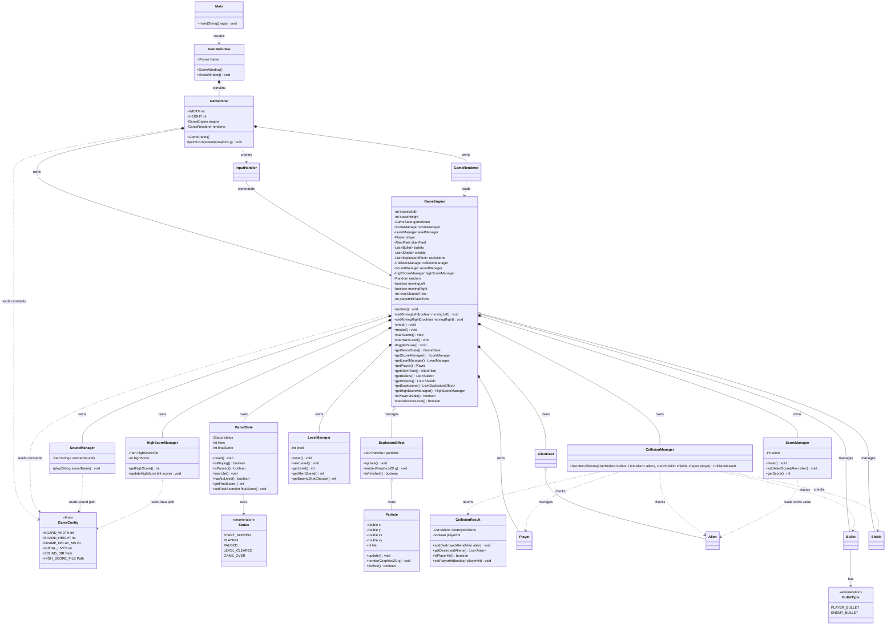
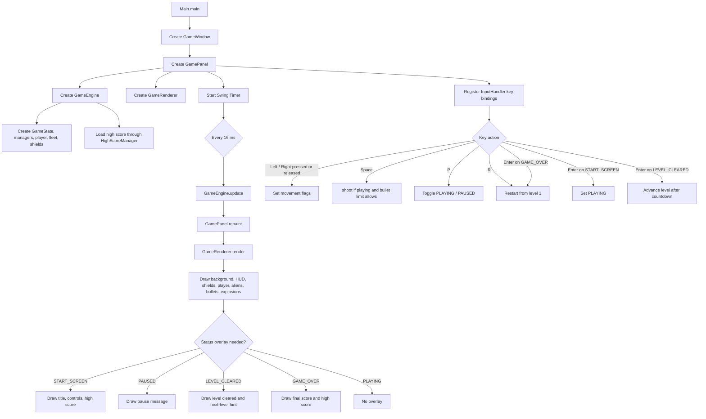
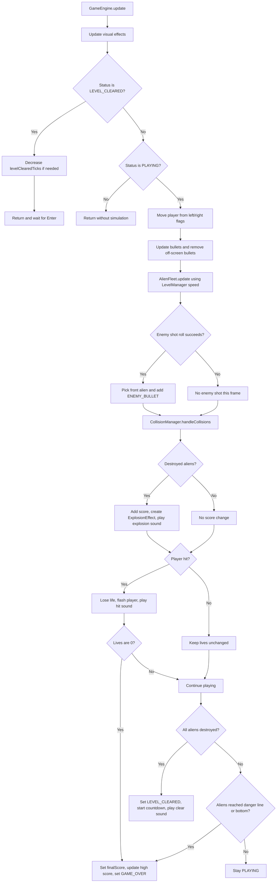
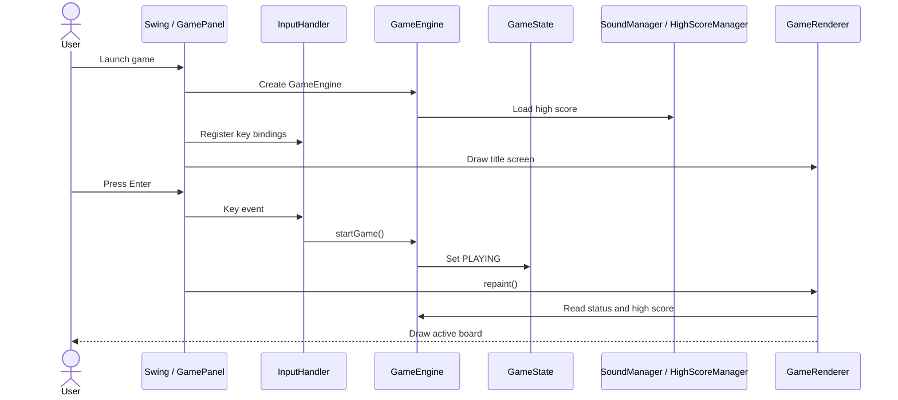
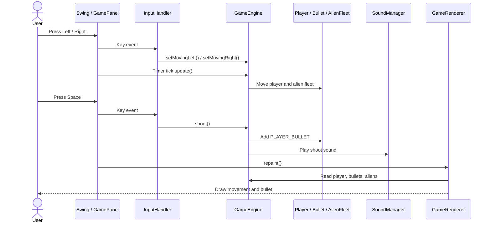
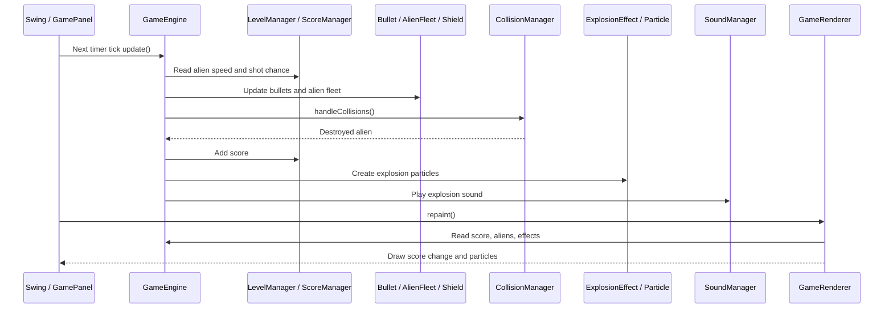
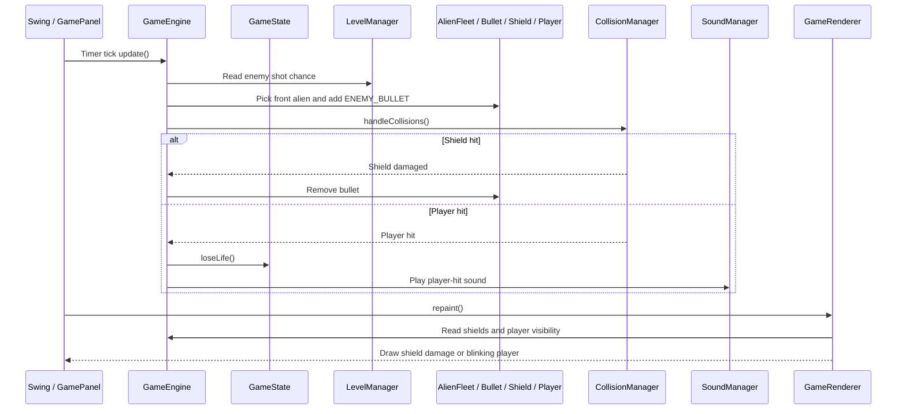
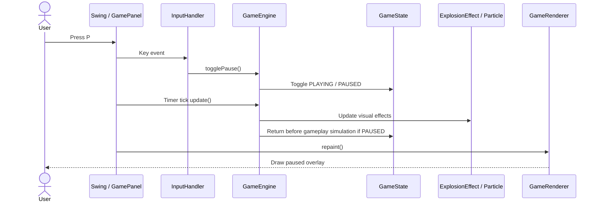
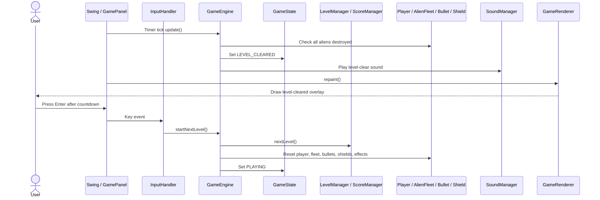
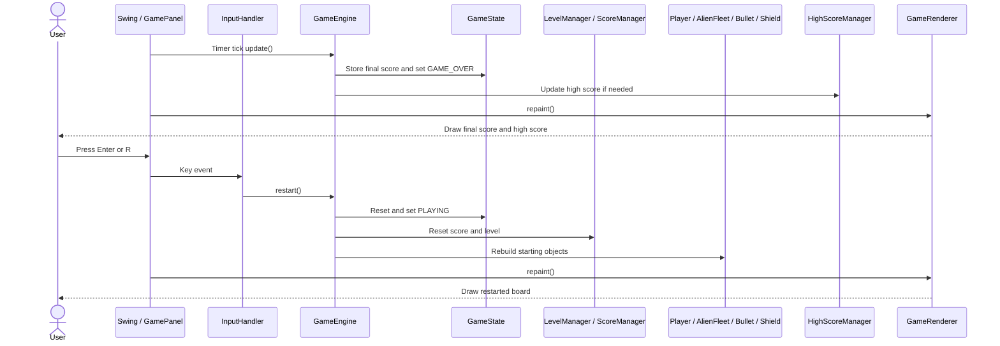

# Version 3 UML Class Model

本文件描述目前最新的 Version 3 class model。Version 3 在 Version 2 的完整規則上加入體驗層：音效、高分紀錄、爆炸動畫、玩家受擊閃爍，以及更完整的開始 / 過關 / Game Over 畫面。

JDK baseline: Version 3 remains compatible with JDK 8. `SoundManager` uses `javax.sound.sampled`, and `HighScoreManager` uses Java 8-compatible NIO file APIs.

## Class Diagram

## Flowchart - Application Lifecycle

## Flowchart - Version 3 Update Loop

## Use Case Scenario

### Scenario 1: Start game from title screen

| Step | User | Swing / GamePanel | InputHandler | GameEngine | GameState | Sound / High Score | GameRenderer |
| --- | --- | --- | --- | --- | --- | --- | --- |
| 1 | Launches game | Creates `GamePanel`; starts Timer | Registers key bindings | Creates game services and objects | Starts at `START_SCREEN` | Loads saved high score | Draws title screen |
| 2 | Presses Enter | Receives key event | Calls `startGame()` | Accepts start command | Changes to `PLAYING` | High score remains available | Draws active board |

1. User launches the game.
2. `GamePanel` creates `GameEngine`, `InputHandler`, and `GameRenderer`.
3. `HighScoreManager` loads the saved high score.
4. User presses Enter.
5. `InputHandler` calls `GameEngine.startGame()`.
6. `GameState` changes from `START_SCREEN` to `PLAYING`.
7. `GameRenderer` draws the active board.

### Scenario 2: Move and shoot

| Step | User | Swing / GamePanel | InputHandler | GameEngine | Model Objects | Sound / High Score | GameRenderer |
| --- | --- | --- | --- | --- | --- | --- | --- |
| 1 | Presses Left or Right | Receives key event | Calls movement setter | Stores movement flag | Player waits for next update | - | - |
| 2 | Waits for frame | Timer calls `update()` | - | Moves player and alien fleet | Player and aliens move | - | - |
| 3 | Presses Space | Receives key event | Calls `shoot()` | Checks bullet limit and creates bullet | Adds `PLAYER_BULLET` | Plays shoot sound | - |
| 4 | Watches result | Calls `repaint()` | - | Exposes current objects | Player, bullet, and aliens are read | - | Draws updated board |

1. User presses Left or Right.
2. `InputHandler` sets movement flags on `GameEngine`.
3. On the next timer tick, `GameEngine.update()` moves the player and alien fleet.
4. User presses Space.
5. `GameEngine.shoot()` adds a `PLAYER_BULLET` if the bullet limit allows it.
6. `SoundManager` plays the shoot sound.
7. `GameRenderer` draws the new positions and bullet.

### Scenario 3: Player bullet destroys an alien

| Step | Swing / GamePanel | GameEngine | Level / Score Managers | Model Objects | Collision / Effects | Sound / High Score | GameRenderer |
| --- | --- | --- | --- | --- | --- | --- | --- |
| 1 | Timer calls `update()` | Updates bullets and fleet | Supplies alien speed | Bullets and aliens move | - | - | - |
| 2 | - | Sends objects to collision check | - | Bullet intersects alien | Reports destroyed alien | - | - |
| 3 | - | Applies result | Adds alien score | Alien is destroyed; bullet removed | Creates explosion particles | Plays explosion sound | - |
| 4 | Calls `repaint()` | Exposes current objects | Score is read | Aliens are read | Effects are read | - | Draws score and particles |

1. Swing Timer calls `GameEngine.update()`.
2. Bullets and alien fleet move.
3. `CollisionManager` checks player bullets against aliens and shields.
4. A destroyed alien is returned to `GameEngine`.
5. `ScoreManager` adds points.
6. `ExplosionEffect` particles are created.
7. `SoundManager` plays the explosion sound.
8. `GameRenderer` draws the updated score and explosion.

### Scenario 4: Enemy bullet hits shield or player

| Step | Swing / GamePanel | GameEngine | GameState | Level Manager | Model Objects | CollisionManager | Sound / High Score | GameRenderer |
| --- | --- | --- | --- | --- | --- | --- | --- | --- |
| 1 | Timer calls `update()` | Rolls enemy shot | Still `PLAYING` | Supplies shot chance | Front alien may create `ENEMY_BULLET` | - | - | - |
| 2 | - | Sends bullets, shields, player to collision check | Still `PLAYING` | - | Enemy bullet reaches target | Reports shield or player hit | - | - |
| 3 | - | Applies result | Loses life if player hit | - | Shield health drops or player flashes | - | Plays hit sound if player hit | - |
| 4 | Calls `repaint()` | Exposes state | Lives are read | - | Shields/player are read | - | - | Draws damage or blink |

1. `GameEngine` may create an enemy bullet from a front alien.
2. `CollisionManager` checks enemy bullets against shields first, then the player.
3. If a shield is hit, shield health decreases and the bullet is removed.
4. If the player is hit, `GameState.loseLife()` runs.
5. `SoundManager` plays the player-hit sound.
6. `GameRenderer` draws shield damage or a blinking player.

### Scenario 5: Pause and resume

| Step | User | Swing / GamePanel | InputHandler | GameEngine | GameState | Collision / Effects | GameRenderer |
| --- | --- | --- | --- | --- | --- | --- | --- |
| 1 | Presses P | Receives key event | Calls `togglePause()` | Switches pause state | Toggles `PLAYING` / `PAUSED` | - | - |
| 2 | Waits while paused | Timer still calls `update()` | - | Returns before gameplay simulation | Remains `PAUSED` | Effects can still age | - |
| 3 | Watches overlay | Calls `repaint()` | - | Exposes paused status | Status is read | Effects are read | Draws paused overlay |

1. User presses P.
2. `InputHandler` calls `GameEngine.togglePause()`.
3. `GameState` toggles between `PLAYING` and `PAUSED`.
4. While paused, `update()` skips gameplay simulation after effect updates.
5. `GameRenderer` draws the paused overlay.

### Scenario 6: Clear level and advance

| Step | User | Swing / GamePanel | InputHandler | GameEngine | GameState | Level / Score Managers | Model Objects | Sound / High Score | GameRenderer |
| --- | --- | --- | --- | --- | --- | --- | --- | --- | --- |
| 1 | Clears final alien | Timer calls `update()` | - | Detects empty fleet | Changes to `LEVEL_CLEARED` | Score preserved | Current wave stops | Plays level-clear sound | - |
| 2 | Waits for countdown | Calls `repaint()` | - | Decrements `levelClearedTicks` | Remains `LEVEL_CLEARED` | Preserved | Preserved | - | Draws clear overlay |
| 3 | Presses Enter | Receives key event | Calls `startNextLevel()` | Starts next wave | Returns to `PLAYING` | Level increases | Rebuilds player/fleet/bullets/shields/effects | - | Draws next level |

1. `GameEngine` detects that all aliens are destroyed.
2. `GameState` changes to `LEVEL_CLEARED`.
3. `SoundManager` plays the level-clear sound.
4. `GameRenderer` draws the level-cleared overlay.
5. After the countdown, user presses Enter.
6. `LevelManager.nextLevel()` increases difficulty.
7. `GameEngine` rebuilds current-level objects and returns to `PLAYING`.

### Scenario 7: Game over and restart

| Step | User | Swing / GamePanel | InputHandler | GameEngine | GameState | Level / Score Managers | Model Objects | Sound / High Score | GameRenderer |
| --- | --- | --- | --- | --- | --- | --- | --- | --- | --- |
| 1 | Loses final life or aliens reach danger line | Timer calls `update()` | - | Runs end-game behavior | Stores final score; becomes `GAME_OVER` | Supplies final score | Stops gameplay objects | Updates high score if needed | - |
| 2 | Watches result | Calls `repaint()` | - | Exposes final data | `GAME_OVER` is read | Score is read | Objects are read | High score is read | Draws final score and high score |
| 3 | Presses Enter or R | Receives key event | Calls `restart()` | Resets session | Returns to `PLAYING` | Score and level reset | Recreates starting objects | High score remains loaded | Draws restarted board |

1. `GameEngine` detects no lives or alien danger-line contact.
2. Final score is stored in `GameState`.
3. `HighScoreManager` updates `data/highscore.txt` if the new score is higher.
4. `GameState` changes to `GAME_OVER`.
5. `GameRenderer` draws final score and high score.
6. User presses Enter or R.
7. `GameEngine.restart()` resets state, score, level, and current objects.
8. `GameRenderer` draws the restarted board.

## Version 3 新增責任

| Class | 責任 |
| --- | --- |
| `GameConfig` | 集中畫面尺寸、速度、音效檔名與 high score 檔案路徑。 |
| `SoundManager` | 播放 wav 音效；缺檔或載入失敗只印 warning。 |
| `HighScoreManager` | 讀寫 `data/highscore.txt`，並在 Game Over 時更新最高分。 |
| `ExplosionEffect` | 管理一組爆炸粒子。 |
| `Particle` | 單一粒子的移動、生命週期與繪製。 |
| `GameEngine` | 協調音效、高分、爆炸效果、玩家受擊閃爍與 V3 狀態轉換。 |
| `GameRenderer` | 繪製開始畫面、過關畫面、Game Over final score / high score 與粒子動畫。 |

## V2 到 V3 的模型差異

Version 2 已經有完整規則；Version 3 沒有推翻它，而是新增體驗層：

- `SoundManager`：音效。
- `HighScoreManager`：高分檔案。
- `ExplosionEffect`、`Particle`：動畫。
- `GameConfig`：集中設定。
- `GameRenderer`：新增開始畫面、Game Over 分數、高分與粒子繪製。
- `GameEngine`：協調音效、動畫、高分與新的過關流程。
